

  

**[Paper](static/pdfs/paper.pdf)** | **[Code](https://anonymous.4open.science/r/FG-RSSA-code-2D45/README.md)** | **[Dataset](https://drive.google.com/file/d/1mSpWMD0sPyM1qY8sSMq9dmE1rbFfirPV/view?usp=sharing)**

## Table of Contents

- [Abstract](#abstract)
- [Dataset Generation](#dataset-generation)
  - [Multi-Source Surgical Video Collection](#multi-source-surgical-video-collection)
  - [SAM2-Driven Instrument Mask Annotation](#sam2-driven-instrument-mask-annotation)
  - [Data Availability](#data-availability)
- [Methodology](#methodology)
  - [Key Contributions](#key-contributions)
  - [Code Availability](#code-availability)
- [Experimental Results](#experimental-results)
  - [Robot-Assisted Simulation Training Datasets](#robot-assisted-simulation-training-datasets)
  - [Clinical Cholecystectomy Datasets](#clinical-cholecystectomy-datasets)
  - [Private Hernia Dataset](#private-hernia-dataset)
- [Discussions](#discussions)
- [CAM GIF Demonstrations](#cam-gif-demonstrations)
- [Citation](#citation)

## Abstract

In robot-assisted surgery, precise and objective surgical skill assessment is essential for ensuring patient safety, optimizing surgeon training, and advancing semi-autonomous surgical systems. However, existing automated evaluation methods generally depend on coarse, video-level global features, failing to capture the fine-grained nuances of surgical maneuvers.

To address this, we propose a fine-grained contrastive learning framework that decomposes skill assessment into three critical dimensions: instrument manipulation, tissue handling, and surgical field clarity. Specifically, we extract video spatiotemporal features fused with instrument mask-guided attention maps to explicitly model dynamic instrument operations. Simultaneously, an intra-video contextual module encodes static global features to characterize tissue state changes and surgical field clarity. Cross-attention mechanisms are then introduced to capture discriminative inter-video representations across key assessment dimensions, and a contrastive regressor is employed to predict relative score disparities.

We extensively validate the proposed model on robot-assisted simulation training datasets and clinical laparoscopic datasets, including JIGSAWS, ROSMA, HeiChole, a private SHURUI robot-assisted cholecystectomy dataset, and a private hernia repair suturing dataset. Our method achieves state-of-the-art performance in Mean Absolute Error (MAE) and Spearman's rank correlation on both simulated and cholecystectomy datasets. On the hernia repair suturing dataset, it yields high-precision regression with an MAE of 0.98, corresponding to 3.92% of the full GOALS score. Furthermore, we construct a large surgical instrument mask dataset comprising 201,318 annotated frames from simulated and clinical videos.

## Dataset Generation

### Multi-Source Surgical Video Collection

The dataset collection spans da Vinci-based robot-assisted training, conventional laparoscopic clinical surgery, and real robot-assisted clinical surgery with the SHURUI platform. This multi-source setting supports evaluation across different surgical platforms, task structures, operative environments, scoring protocols, and validation settings.

  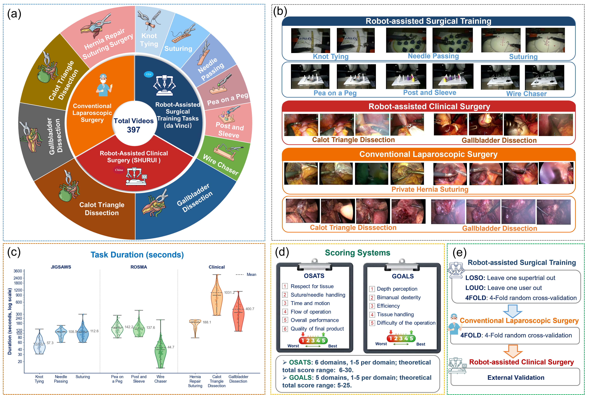

> **Fig. 1.** Dataset composition, representative video frames, task duration distributions, scoring systems, and experimental settings.

The robot-assisted training setting includes JIGSAWS tasks (Knot Tying, Suturing, and Needle Passing) and ROSMA tasks (Post and Sleeve, Pea on a Peg, and Wire Chaser), both scored with modified OSATS protocols. The conventional laparoscopic setting includes HeiChole cholecystectomy phases (Calot Triangle Dissection and Gallbladder Dissection) and private hernia repair suturing videos, both evaluated with modified GOALS-style scoring. The private SHURUI robot-assisted cholecystectomy dataset is used as an external validation set: weights trained on HeiChole are directly transferred to SHURUI without target-domain fine-tuning.

In total, the evaluation covers JIGSAWS, ROSMA, HeiChole, a private hernia repair suturing dataset, and a private SHURUI robot-assisted cholecystectomy dataset. JIGSAWS includes 36 Knot Tying, 39 Suturing, and 28 Needle Passing videos from eight participants. ROSMA contains 206 training videos across Post and Sleeve, Pea on a Peg, and Wire Chaser. HeiChole contributes 24 complete cholecystectomy procedures, yielding 48 phase-level samples for skill assessment, while the private hernia dataset contains 34 laparoscopic suturing videos. The SHURUI dataset contains three complete robot-assisted cholecystectomy procedures and is used only for external validation.

### SAM2-Driven Instrument Mask Annotation

  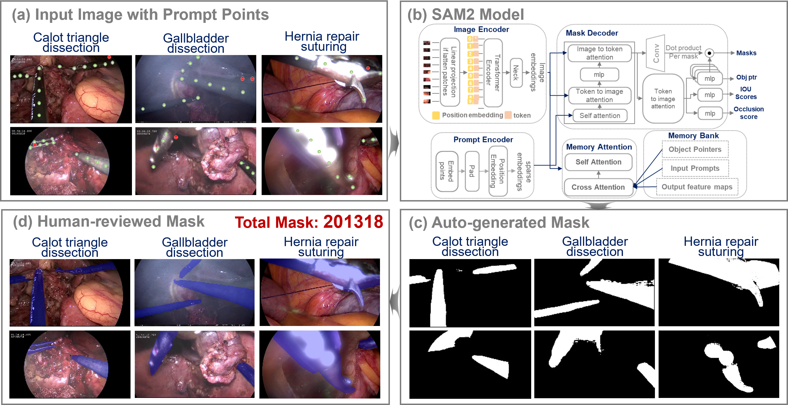

> **Fig. 3.** Workflow for constructing the SSA-oriented surgical instrument mask dataset using SAM2 and expert refinement.

We constructed a large-scale surgical instrument mask dataset with **201,318** annotated frames from both simulated training tasks and clinical surgical videos. SAM2 was used as an offline initialization tool to generate preliminary instrument masks, followed by manual verification and refinement to correct missing regions, false positives, and boundary errors.

To assess annotation quality, we performed a quality audit using the manual correction rate and Dice similarity between the initial SAM2 masks and the refined masks. For simulation tasks, the manual correction rate was **2.34%-5.36%**, with Dice scores of **89.36%-93.49%**. For clinical scenarios, the correction rate increased to **7.14%-9.87%**, with Dice scores of **86.52%-88.37%**. These quality-controlled masks provide instrument-region priors for segmentation-guided feature reweighting in our surgical skill assessment framework.

|  |  |
| --- | --- |
|  |  |
|  |  |

### Data Availability

We have released part of the private hernia repair suturing data and the SHURUI robot-assisted simulated clinical data through the link below. More data and related resources will be progressively updated. The complete dataset, instrument mask annotations, and full joint instrument-tissue modeling framework will be made available upon formal acceptance of the paper, subject to applicable privacy and data-use restrictions.

Dataset access: [Google Drive](https://drive.google.com/file/d/1mSpWMD0sPyM1qY8sSMq9dmE1rbFfirPV/view?usp=sharing)

## Methodology

We propose a fine-grained contrastive learning framework for surgical skill assessment. The framework decomposes surgical videos into instrument-region motion, tissue-context appearance, and global procedural dynamics, then compares a query video against a high-performing reference video to predict relative score differences.

  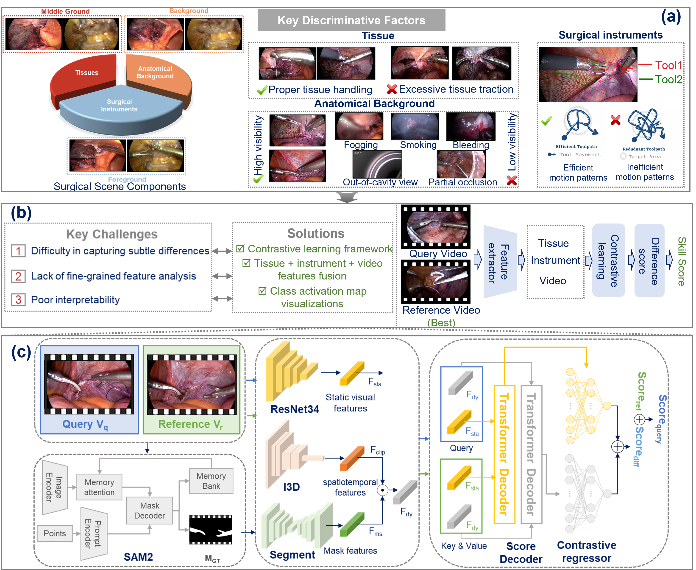

> **Fig. 2.** Overall method framework, including surgical scene decomposition, key challenges and solutions, and the fine-grained contrastive learning architecture.

Following the paper, the method can be summarized in four tightly coupled parts: a contrastive problem formulation, a SAM2-supported instrument-mask construction pipeline, an instrument-region motion branch, and a tissue-context branch with query-reference contrastive decoding.

**Problem Formulation.** Instead of predicting skill scores from single videos independently, the paper formulates SSA as prediction of the **relative score difference** between a query video and a high-performing reference video. The predicted query score is obtained by adding the regressed score difference to the annotated score of the reference video, making the task explicitly comparison-centric.

**Instrument Mask Dataset Construction via SAM2.** SAM2 is used as an offline initialization engine to generate preliminary surgical instrument masks from simulated and clinical videos. Positive and negative prompt points are placed on the initial frame, and the generated masks are then manually reviewed and refined. The resulting **201,318** quality-controlled annotations provide the spatial priors used to train the auxiliary segmentation branch.

**Instrument-Region Motion Modeling.** An I3D-based dynamic branch extracts snippet-level spatiotemporal representations from overlapping 16-frame clips. A segmentation-guided feature reweighting module then uses segmentation-derived features to reweight dynamic representations **in the aligned feature space**, rather than directly multiplying image-space masks with I3D feature maps. This guides the model toward instrument-region motion cues that are directly relevant to technical skill.

**Frame-Level Tissue-Context Modeling and Contrastive Decoding.** In parallel, a ResNet-34-based branch extracts frame-level appearance and surgical-scene contextual features related to tissue structures, instrument-tissue interaction regions, and surgical-field appearance. Separate cross-attention decoders compare the query and reference representations in the dynamic branch and the tissue-context branch, and branch-specific regressors estimate score differences that are averaged for final prediction.

### Key Contributions

Building upon reference-video-based contrastive regression, we propose a fine-grained visual modeling framework for surgical skill assessment in robot-assisted minimally invasive surgery. The framework integrates instrument-region guidance, frame-level tissue-context representation, and temporal process modeling to capture complementary visual cues related to instrument manipulation, tissue interaction, and surgical-field appearance.

1. **Multi-Source Surgical Video Collection and Instrument Mask Annotations**

We construct a large-scale multi-source surgical video collection for robot-assisted surgical skill assessment. The collection includes robotic simulation training tasks, conventional laparoscopic clinical videos, and real robot-assisted clinical surgery videos. In addition, we provide **201,318** surgical instrument mask annotations generated using SAM2 and refined through manual verification. The dataset, instrument mask annotations, and related resources will be made available on our project homepage upon acceptance, subject to applicable privacy and data-use restrictions.

2. **Fine-Grained Instrument-Tissue Visual Modeling**

We propose a fine-grained visual modeling framework that integrates instrument-region-guided motion representation with frame-level tissue-context representation. An I3D-based dynamic branch extracts snippet-level motion features, while an auxiliary segmentation branch trained with quality-controlled instrument masks provides instrument-region guidance. In parallel, a ResNet-34-based tissue-context branch extracts frame-level appearance and surgical-scene contextual features related to tissue structures, instrument-tissue interaction regions, and surgical-field appearance. By combining these complementary cues, the proposed framework better captures fine-grained visual factors associated with surgical skill.

3. **Multi-Source Dataset Validation**

We evaluate the proposed framework on an expanded multi-source dataset collection covering three surgical settings: robot-assisted surgical training, conventional laparoscopic clinical surgery, and robot-assisted clinical surgery. JIGSAWS and ROSMA are used to assess skill perception in standardized robotic training tasks. HeiChole and a private hernia repair suturing dataset are used to evaluate adaptability and robustness under realistic clinical visual complexity. The SHURUI robot-assisted cholecystectomy dataset is used as an independent external validation set to further assess generalization in real robot-assisted clinical scenarios. This progressive validation design enables a more comprehensive assessment across different surgical platforms, operative tasks, and levels of clinical realism.

### Code Availability

The full implementation of the fine-grained contrastive learning framework is currently being organized for open-source release. All resources will be fully open-sourced upon formal acceptance of the paper.

Anonymous review repository: [Code](https://anonymous.4open.science/r/FG-RSSA-code-2D45/README.md)

## Experimental Results

We conducted experiments across robot-assisted simulation training data, conventional laparoscopic clinical videos, and real robot-assisted clinical surgery videos. Following the paper, evaluation is performed primarily with **Spearman's Rank Correlation Coefficient (SRCC)** and **Mean Absolute Error (MAE)**. SRCC measures rank-order consistency between predicted and expert scores, while MAE measures absolute regression error.

The implementation follows the paper's reported setup: the framework is implemented in PyTorch, uses an I3D backbone pre-trained on Kinetics and a ResNet-34 tissue-context branch, applies Adam optimization, fixes the number of cross-attention heads at **8**, and trains for up to **100 epochs** on robot-assisted simulation datasets and **150 epochs** on clinical datasets with early stopping. The paper also reports **49.2M** trainable parameters, **4.73 GB** peak inference memory, **21 FPS** inference speed, and a checkpoint size of **452.57 MB**.

Overall, the results show that query-reference contrastive modeling, segmentation-guided instrument-region motion features, and tissue-context representations jointly improve continuous score prediction and rank-order consistency.

### Robot-Assisted Simulation Training Datasets

We evaluate the framework on JIGSAWS and ROSMA robot-assisted simulation training datasets. On JIGSAWS, the model maintains favorable ranking consistency across Knot Tying, Needle Passing, and Suturing under LOUO, LOSO, and randomized 4-fold cross-validation. Except for Suturing under LOUO, all SRCC values are higher than 0.80, with the highest SRCC reaching 0.94.

  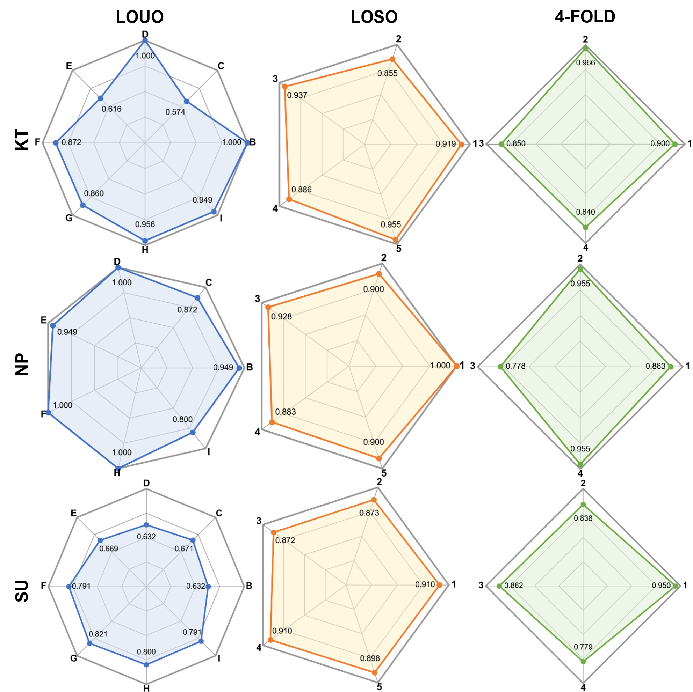
  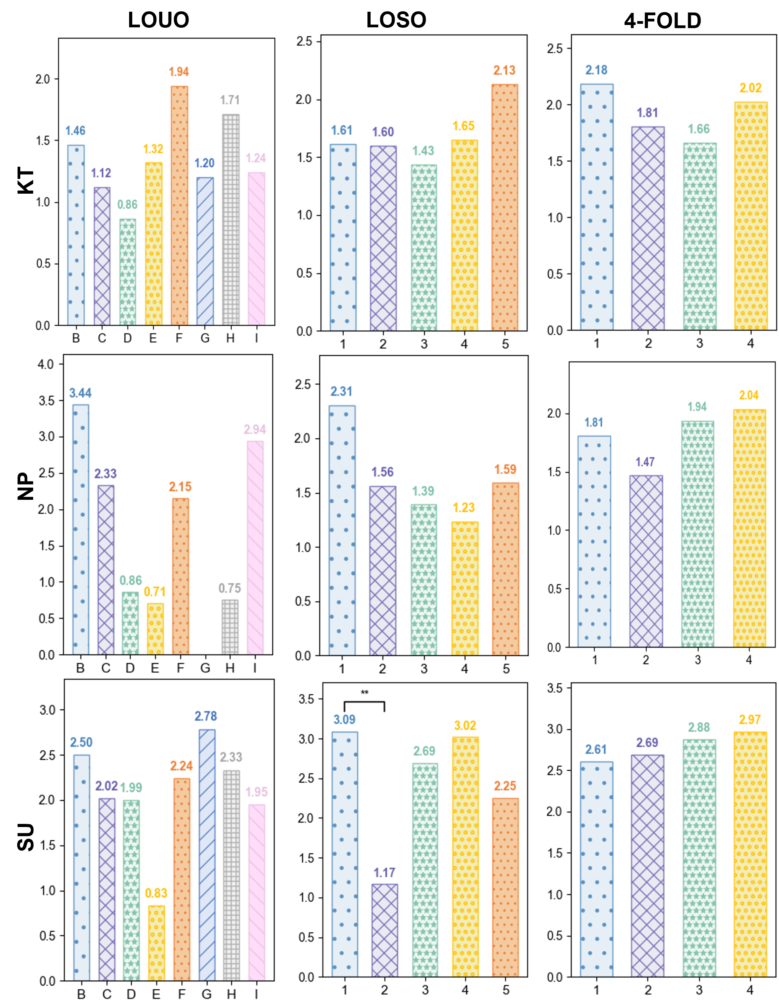

Fig. 4 visualizes fold-wise SRCC variations across tasks and evaluation settings, while Fig. 5 summarizes fold-wise MAE results. In the JIGSAWS experiments, the maximum MAE is 2.79 and the overall MAE range across tasks and settings is 1.43, corresponding to 4.77% of the maximum OSATS score of 30.

  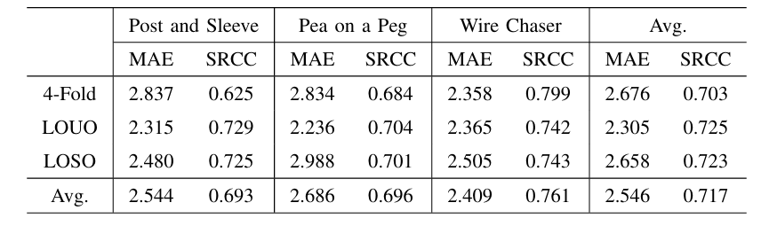

> **Table II.** Performance of the proposed framework on the ROSMA dataset under randomized 4-fold cross-validation, LOUO, and LOSO evaluation settings.

On ROSMA, the proposed method maintains stable continuous score prediction and rank-order consistency, with an overall average **MAE of 2.546** and **SRCC of 0.717** across Post and Sleeve, Pea on a Peg, and Wire Chaser. The best average performance is obtained under **LOUO** with an MAE of **2.305** and an SRCC of **0.725**, while Wire Chaser achieves the highest task-level average SRCC of **0.761** and reaches **0.799** under randomized 4-fold cross-validation. These results further support the applicability of the framework to robot-assisted training tasks with different participants and procedural patterns.

### Clinical Cholecystectomy Datasets

On HeiChole, each procedure is analyzed in two key phases: Calot Triangle Dissection and Gallbladder Dissection. The dataset provides 48 phase-level samples derived from 24 complete laparoscopic cholecystectomy procedures, with observed skill scores concentrated in the range of 15 to 21. Under randomized 4-fold cross-validation, the proposed method achieves an overall mean MAE of 0.97 and mean SRCC of 0.76 across the two phases. The MAE values range from 0.752 to 1.115, corresponding to approximately 3.76% to 5.58% of the full GOALS score interval.

  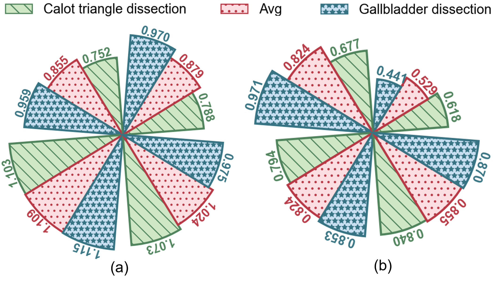

The model trained on HeiChole is also externally validated on the private SHURUI robot-assisted cholecystectomy dataset without target-domain fine-tuning. This external validation set contains three complete robot-assisted cholecystectomy procedures scored under a modified GOALS protocol. The model achieves MAE values of 1.453 and 1.582 for Calot Triangle Dissection and Gallbladder Dissection, respectively, with an average MAE of 1.518. Given the limited sample size, this should be interpreted as preliminary evidence of cross-platform clinical applicability from conventional laparoscopic videos to real robot-assisted cholecystectomy videos.

### Private Hernia Dataset

The private hernia repair suturing dataset contains 34 laparoscopic suturing videos scored by experienced clinical experts under a modified GOALS protocol. The average video duration is 188.1 seconds, and the observed score range is 15 to 21. With randomized 4-fold cross-validation, the model achieves a mean MAE of 0.979 and a mean SRCC of 0.737, demonstrating strong performance in both absolute score prediction and relative skill ranking.

  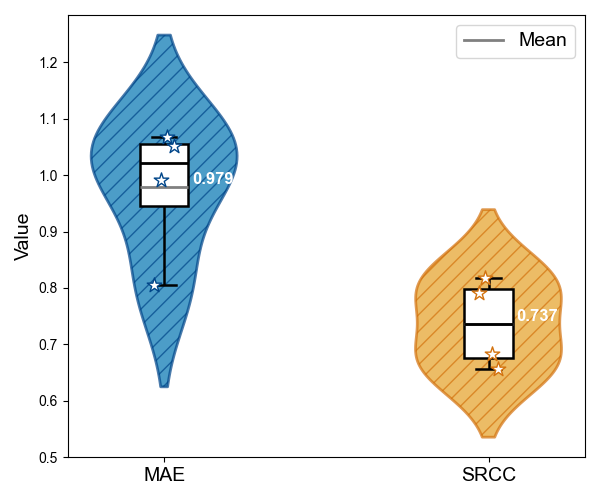

> **Fig. 7.** MAE and SRCC distributions across 4-fold cross-validation.

Across the four folds, MAE ranges from 0.806 to 1.067 and SRCC ranges from 0.656 to 0.818. These results indicate stable clinical score regression even on a small dataset with a concentrated score distribution.

For the newly incorporated ROSMA and private hernia repair suturing datasets, the paper also reports strong inter-rater reliability in the expert annotations. ROSMA re-annotations achieved ICC(2,1) values above 0.90 across tasks, and the hernia repair suturing dataset achieved an ICC(2,1) of 0.91, indicating high agreement among the surgeons who produced the final labels.

### Comparative Results

The paper compares the proposed framework against kinematic-based, video-based, and hybrid kinematic-plus-video methods on the JIGSAWS dataset, and against multiple video-based baselines on the HeiChole dataset. On JIGSAWS, the proposed method achieves competitive or superior SRCC and MAE values across tasks and evaluation protocols. On HeiChole, the paper reports that the proposed method outperforms the strongest listed baseline with **MAE 0.97 (+8.49%)** and **SRCC 0.76 (+31.03%)**, indicating improved ranking consistency and lower score regression error in clinical cholecystectomy videos.

### Ablation Results

The ablation study in the paper is conducted under randomized 4-fold cross-validation on JIGSAWS. It evaluates the I3D backbone, the segmentation-guided instrument module, the ResNet-34 tissue-context module, and the contrastive regression component. When the model relies only on single-video features, the overall SRCC remains within **0.396 to 0.517**. After introducing query-reference contrastive regression, the SRCC range increases to **0.600 to 0.880**. The full model achieves **MAE 2.171** and **SRCC 0.880**, and removing either the instrument module or the tissue module causes clear performance degradation, showing that these two components contribute complementary information for SSA.

## Discussions

### Evaluation On The Selection Of Reference Video

  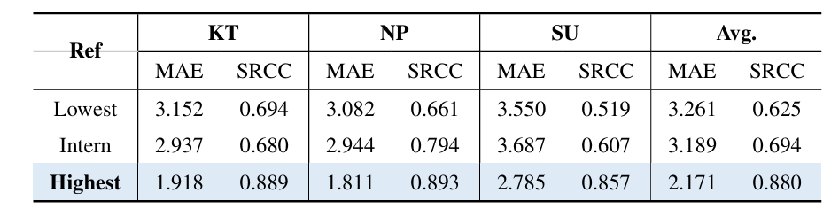

> **Table V.** Evaluation on the selection of reference video.

Using the highest-scoring reference video consistently gives the best performance, reducing MAE by **1.090** and **1.018** and improving SRCC by **40.80%** and **26.80%** relative to low- and intermediate-scoring references.

### Evaluation On The Number Of Attention Heads

  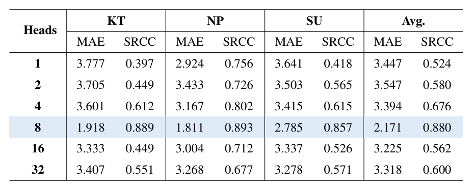

> **Table VI.** Evaluation on the number of attention heads.

The best average performance is obtained with **8** attention heads, while fewer heads limit representation diversity and too many heads reduce the feature capacity assigned to each attention subspace.

### CAM Visualization of Tissue and Instrument Features

  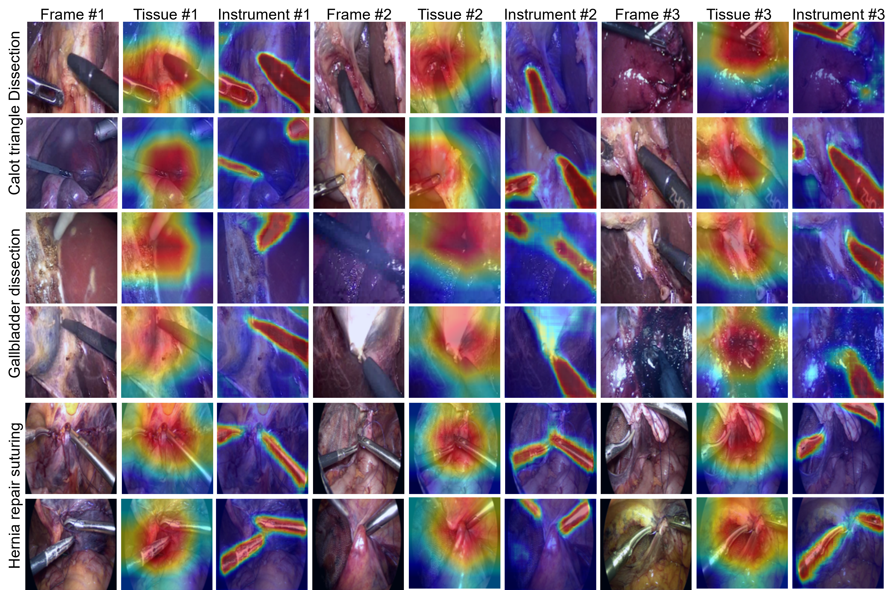

> **Fig. 8.** CAM visualizations of instrument features extracted by the mask-guided attention module and tissue features extracted by the intra-video contextual modeling module.

CAM visualizations show that the model consistently focuses on instruments, tissue structures, and instrument-tissue interaction regions, supporting the interpretability of the proposed joint instrument-tissue modeling framework.

## CAM GIF Demonstrations

The first three instrument-tissue CAM pairs correspond to lower-MAE cases. Their activation patterns are more tightly focused on regions that are directly related to the surgical manipulation, indicating more accurate localization of skill-relevant visual cues. The fourth pair corresponds to a relatively weaker prediction case, where the highlighted regions are less precisely concentrated on the most operation-relevant areas.

| Instrument CAM | Tissue CAM |
| --- | --- |
| 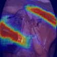 | 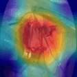 |
| 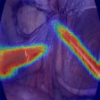 | 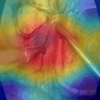 |
| 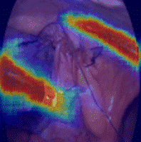 | 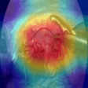 |
| 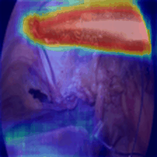 | 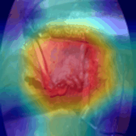 |

## Citation

Citation information will be added after the paper is accepted.
